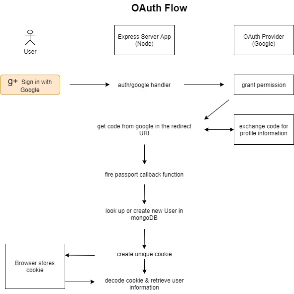

# PassportJS - OAuth2 - Express/Node - MongoDB

## Important

Passport v.0.6.0 is currently broken due to an incompatibility: "https://github.com/jaredhanson/passport/issues/907"

The maintainer suggests using the latest v0.5.0 until a fix is pushed out. Use:

```sh
npm uninstall passport
```

```sh
npm install passport@0.5
```

---



### Flow explained

First: Look at the docs on [PassportJS](https://www.passportjs.org/packages/passport-google-oauth20/) webpage. And look for your preferred OAuth-Strategy.

"Before using passport-google-oauth20, you must register an application with Google. If you have not already done so, a new project can be created in the [Google Developers Console](https://console.cloud.google.com/apis/dashboard). Your application will be issued a client ID and client secret, which need to be provided to the strategy. You will also need to configure a redirect URI which matches the route in your application.

**_Configure Strategy_**

The Google authentication strategy authenticates users using a Google account and OAuth 2.0 tokens. The client ID and secret obtained when creating an application are supplied as options when creating the strategy. The strategy also requires a verify callback, which receives the access token and optional refresh token, as well as profile which contains the authenticated user's Google profile. The verify callback must call cb providing a user to complete authentication."

When you are logging in using google and the backend gets back the user profile information,
it ll either look for that in the db if the user already exists or create a new User,
either way (if its a known or new User) it gonna takes that user, grabs the id from it,
stuffs it in a cookie, encrypts it and sends it to the browser.

And when the browser makes any subsequent requests, it gonna sends along the encrypted cookie with it, on the server its gonna be de-encrypted, then the user can be deserialized by grabbing the id and associating it with a user in the db, so that we know then what user is associated in the session - in other words: who is logged in.
